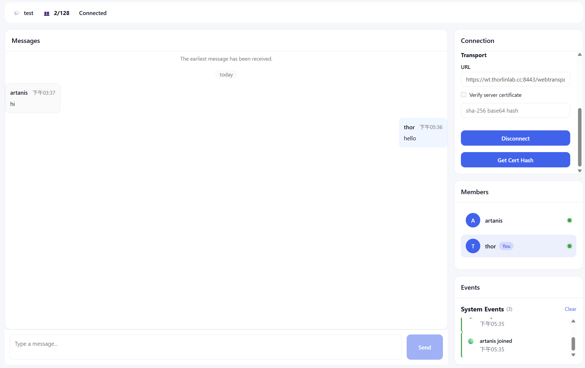

# WebTransport Chat Demo

A real-time chat room demo built on **WebTransport (HTTP/3 + QUIC)**, with a Go backend and a React (TypeScript) frontend. It demonstrates a full local-development-to-Kubernetes workflow, including a custom binary wire protocol, Gateway API (Envoy Gateway) UDP/HTTP routing, and automated TLS via cert-manager + Cloudflare DNS-01.

## Features

- **Real-time messaging** over WebTransport — join a room and chat with other connected users with low latency.
- **Presence / member list** — see who else is currently in the room (join/leave events broadcast to all members).
- **Chat history** — new members fetch prior messages in the room on join; history is persisted in MongoDB.
- **Custom binary protocol** — a lightweight framed message protocol (header + opcode + msgpack payload) shared between the Go server and the TypeScript client, supporting hello/ping-pong, chat, join/leave, member list, and room info messages.
- **Reconnect & heartbeat** — the frontend client automatically reconnects and keeps the session alive with ping/pong.
- **Dependency-injected backend** — Go backend wired with [google/wire], layered as `handler -> service -> dao`, backed by MySQL (relational data), MongoDB (chat messages), and Redis (cache).
- **Two deployment paths** — run directly on your machine (`go run` / `npm run dev`) or deploy the full stack to Kubernetes with Kustomize + Envoy Gateway.

## Tech Stack

| Layer         | Technology |
|---------------|------------|
| Transport     | WebTransport over HTTP/3 (QUIC), via [quic-go](https://github.com/quic-go/quic-go) & [webtransport-go](https://github.com/quic-go/webtransport-go) |
| Backend       | Go, Gin (HTTP), Wire (DI), GORM (MySQL), MongoDB Go Driver, go-redis, Viper (config) |
| Frontend      | React 19, TypeScript, Vite, Zustand (state), TanStack Query, msgpack |
| Data stores   | MySQL, MongoDB, Redis |
| Containers    | Docker, Docker Compose |
| Orchestration | Kubernetes, Kustomize, Envoy Gateway (Gateway API), cert-manager |
| DNS / TLS     | Cloudflare (DNS-01 challenge) |
| Task runner   | [Task](https://taskfile.dev/) (`taskfile.yaml`) |

## Prerequisites

### Required for local development

- **Go** `1.26.0+`
- **Node.js** `22+` and **npm**
- **[Task](https://taskfile.dev/installation/)** `3.x` — used to run all project commands (`taskfile.yaml`)
- **[wire](https://github.com/google/wire)** — installed automatically by Task via `task backend:wire:ensure`
- **Docker** & **Docker Compose** — for running the full stack in containers, or running MySQL / MongoDB / Redis locally
- A modern browser with WebTransport support (Chrome / Edge 97+)

### Additional for local HTTPS certificates

WebTransport requires a valid (or trusted) TLS certificate even for local development.

- **[mkcert](https://github.com/FiloSottile/mkcert)** — to generate a locally-trusted certificate, or
- set `WEBTRANSPORT_USE_SELF_CERT=true` (backend) to use a generated self-signed certificate and `VITE_WEBTRANSPORT_USE_CERT_HASH=true` (frontend) so the browser pins the cert hash instead of validating a CA chain

### Required for Kubernetes deployment

- A running Kubernetes cluster (e.g. Docker Desktop, kind, k3d, or a cloud cluster) with `kubectl` configured
- **[Helm](https://helm.sh/)** `3.x`
- **[Kustomize](https://kustomize.io/)** (bundled with `kubectl apply -k`)
- **[Envoy Gateway](https://gateway.envoyproxy.io/)** — installed via Task (`task envoy:install`), provides the Gateway API implementation with HTTP + UDP listeners
- **[cert-manager](https://cert-manager.io/)** `v1.21+` — installed via Task (`task cert:install`), issues TLS certificates via Let's Encrypt
- **A Cloudflare account and API token** — used by cert-manager's DNS-01 solver to issue certificates for the `thorlinlab.cc` zone (see [Cloudflare setup](#cloudflare-setup) below)
- MongoDB Kubernetes Operator and Redis Operator (Helm-based) — installed via Task, used by the `data` overlay for local/dev data stores

## Directory Structure

```
webtransport_demo/
├── taskfile.yaml                 # Root Task entrypoint, includes all sub-taskfiles
├── app/
│   ├── docker-compose.yaml       # Local full-stack compose (backend, migrator, frontend)
│   ├── backend/                  # Go WebTransport chat server
│   │   ├── cmd/
│   │   │   ├── server/           # main.go + wire.go for the API/WebTransport server
│   │   │   └── migrate/          # main.go + wire.go for DB migrations (GORM + MongoDB)
│   │   ├── configs/               # server.yaml / migrate.yaml (+ .local variants)
│   │   ├── internal/
│   │   │   ├── frameworks/       # config, db, errorx, coroutine, logger helpers
│   │   │   ├── model/             # domain models & entities
│   │   │   ├── dao/               # data access (chatd, userd)
│   │   │   ├── service/           # business logic (auths, chats, users)
│   │   │   ├── handler/           # WebTransport/HTTP request handlers
│   │   │   ├── middleware/        # error reply middleware, etc.
│   │   │   ├── protocol/          # opcode definitions shared with the client protocol
│   │   │   └── server/
│   │   │       ├── wts/           # WebTransport server, hub, room, framing, protocol
│   │   │       └── https/         # Gin HTTP server & router (health checks, REST)
│   │   ├── Dockerfile.server
│   │   └── Dockerfile.migrate
│   └── frontend/                 # React + TypeScript chat client
│       ├── src/
│       │   ├── transport/         # WebTransport/HTTP transport implementations
│       │   ├── protocol/          # binary frame encode/decode (mirrors backend opcodes)
│       │   ├── providers/hooks/   # ChatProvider, use-chat hook
│       │   ├── services/          # chat, heartbeat, reconnect, welcome services
│       │   ├── components/        # chat, connection, layout, common UI components
│       │   └── pages/             # ChatPage, DashboardPage, SettingsPage
│       └── Dockerfile
├── deploy/                       # Kubernetes manifests (Kustomize)
│   ├── bootstrap/                # ClusterIssuer (Let's Encrypt + Cloudflare DNS-01) & Certificate
│   ├── data/                     # MySQL / MongoDB / Redis (base + local overlay via operators)
│   ├── migration/                # One-off migration Job (templated per env/version)
│   └── app/                      # backend & frontend Deployments/Services + Gateway/HTTPRoute/UDPRoute
└── resources/
    ├── taskfiles/                # backend, frontend, docker, k8s, envoy, cert-manager, operators, migration
    ├── envoy/                    # Envoy Gateway Helm values
    ├── mongodb-operator/         # MongoDB Community Operator Helm values
    ├── redis-operator/           # Redis Operator Helm values
    └── tools/template/           # small Go tool used to template migration kustomizations
```

## Quick Start — Run Locally (`go run` / `npm run dev`)

This runs the backend and frontend directly on your machine, against local MySQL / MongoDB / Redis instances (bring your own, or start them via Docker).

1. **Install dependencies**

   ```bash
   task frontend:install
   ```

2. **Configure environment** — the backend reads `app/backend/configs/server.local.yaml` by default for local runs, with sane defaults for `127.0.0.1` databases. Override any value with environment variables (see the `${VAR:default}` placeholders in that file), or via the root `.env` (loaded by Task's `dotenv`).

3. **Run database migrations**

   ```bash
   task backend:run:migrate
   ```

4. **Run the backend** (this also (re)generates Wire dependency-injection code automatically)

   ```bash
   task backend:run:server
   ```

   The API listens on `:8080` (HTTP) and the WebTransport endpoint on `:8443/udp` (self-signed cert by default in local config).

5. **Run the frontend**

   ```bash
   task frontend:dev
   ```

   Vite serves the app on `http://localhost:5173`. The frontend connects to `https://localhost:8443/webtransport` by default (see `app/frontend/.env.development`).

6. Open the app in a WebTransport-capable browser, enter a display name and room, and start chatting. Open a second browser/tab to see the member list and messages update in real time.

> Note: When using a self-signed certificate, the frontend must trust the server's certificate hash (`VITE_WEBTRANSPORT_USE_CERT_HASH=true`) — Chrome-based browsers use this to allow untrusted certs for WebTransport in development. For a fully trusted local certificate instead, generate one with `mkcert` and point `WEBTRANSPORT_SERVER_CERT_FILE` / `WEBTRANSPORT_SERVER_KEY_FILE` at it.

### Alternative: Run with Docker Compose

```bash
task docker:build   # build backend + frontend images
task docker:up      # start backend, migrator, frontend containers
task docker:logs    # follow logs
task docker:down    # stop everything
```

This exposes the backend on `8080` (HTTP) and `8443/udp` (WebTransport), and the frontend on `5173`.

## Deploying to Kubernetes

The `k8s` task family (`resources/taskfiles/k8s.yaml`) applies four Kustomize layers in order: **bootstrap** (TLS) → **data** (MySQL/MongoDB/Redis) → **migration** (schema/data setup) → **app** (backend/frontend/Gateway routing).

### Cloudflare setup

Kubernetes TLS certificates are issued by cert-manager using a Let's Encrypt `ClusterIssuer` with a **Cloudflare DNS-01** solver, scoped to the `thorlinlab.cc` zone (see `deploy/bootstrap/base/cluster-issuer-production.yaml`). You'll need:

1. A Cloudflare API token with `Zone:DNS:Edit` permission for your zone.
2. Export it before running the bootstrap task (or place it in a root `.env` file, which Task loads automatically):

   ```bash
   export DNS_API_TOKEN="<your-cloudflare-api-token>"
   ```

3. cert-manager will create the corresponding Kubernetes secret for you:

   ```bash
   task cert:apitoken   # creates the cloudflare-api-token secret in the cert-manager namespace
   ```

If you're deploying to your own domain instead of `thorlinlab.cc`, update the hostnames in:
- `deploy/bootstrap/base/certificate.yaml`
- `deploy/bootstrap/base/cluster-issuer-*.yaml`
- `deploy/app/base/gateway/gateway.yaml`, `http-route.yaml`
- `app/frontend/.env.production`

### Deploy everything

```bash
task k8s:apply env=local
```

This will, in order:
1. Install cert-manager (if missing) and apply the `ClusterIssuer` + `Certificate` (bootstrap).
2. Install the Redis Operator / MongoDB Community Operator and apply MySQL/MongoDB/Redis manifests (data).
3. Run the migration Job against the freshly created databases.
4. Install Envoy Gateway (if missing) and deploy the `backend` / `frontend` Deployments, Services, `Gateway`, `HTTPRoute`s and `UDPRoute` (app).

Useful variants:

```bash
task k8s:apply:bootstrap env=local
task k8s:apply:data      env=local
task k8s:apply:migration env=local migration_tag=v1
task k8s:apply:app       env=local

task k8s:delete env=local          # tear down everything
task k8s:restart env=local         # rolling restart backend + frontend
task k8s:get                       # list all resources across namespaces
```

### Networking overview

- **Gateway** (`deploy/app/base/gateway/gateway.yaml`) exposes:
  - an **HTTPS** listener on `443` for `*.thorlinlab.cc`, terminating TLS with the cert-manager–issued certificate.
  - a **UDP** listener on `8443` dedicated to WebTransport/QUIC traffic.
- **HTTPRoute**s route `api.thorlinlab.cc/api/*` → `backend:8080` and `app.thorlinlab.cc/app/*` → `frontend:80`.
- **UDPRoute** routes WebTransport UDP traffic → `backend:8443`.

### Local domain testing

To exercise the Kubernetes deployment against `thorlinlab.cc`-style hostnames from your machine, point them at your cluster's ingress IP in your hosts file, e.g.:

```
<cluster-ip>  app.thorlinlab.cc
<cluster-ip>  api.thorlinlab.cc
<cluster-ip>  wt.thorlinlab.cc
```

Then verify:

```bash
curl https://api.thorlinlab.cc/api/healthz
```

and open `https://app.thorlinlab.cc/app/` in a browser to use the chat UI end-to-end against the cluster.

## Configuration Reference

### Backend (`app/backend/configs/server*.yaml`, overridable via env vars)

| Variable | Default | Description |
|---|---|---|
| `HTTP_SERVER_PORT` | `8080` | Gin HTTP server port |
| `HTTP_CORS_ENABLED` | `true` (local) | Enable CORS middleware |
| `HTTP_CORS_ALLOW_ORIGINS` | — | Comma-separated allowed origins |
| `WEBTRANSPORT_SERVER_PORT` | `8443` | WebTransport (QUIC/UDP) listener port |
| `WEBTRANSPORT_SERVER_PATH` | `/webtransport` | WebTransport endpoint path |
| `WEBTRANSPORT_SERVER_USE_SELF_CERT` | `false` | Generate a self-signed cert instead of loading files |
| `WEBTRANSPORT_SERVER_CERT_FILE` / `_KEY_FILE` | `/certs/tls.crt` / `/certs/tls.key` | TLS certificate/key paths |
| `DB_MYSQL_*` | see `server.yaml` | MySQL connection & pool settings |
| `DB_MONGODB_*` | see `server.yaml` | MongoDB connection settings |
| `DB_REDIS_*` | see `server.yaml` | Redis connection settings (single/cluster/sentinel) |
| `LOG_LEVEL` | `info` | Zap log level |

### Frontend (`app/frontend/.env*`)

| Variable | Description |
|---|---|
| `VITE_WEBTRANSPORT_ENDPOINT` | Full WebTransport URL (e.g. `https://wt.thorlinlab.cc/webtransport`) |
| `VITE_API_BASE_URL` | Base URL for REST calls to the backend |
| `VITE_WEBTRANSPORT_USE_CERT_HASH` | Trust server cert by hash instead of CA validation (dev only) |
| `VITE_WEBTRANSPORT_CERT_HASH` | The certificate hash to pin, when the above is enabled |

## Testing

- **Backend unit tests**: `task backend:test` (runs `go test ./...`)
- **Local end-to-end**: run the backend + frontend as described in [Quick Start](#quick-start--run-locally-go-run--npm-run-dev), open two browser sessions in the same room, and confirm messages, join/leave events, and chat history all sync correctly.
- **Health checks**: the backend exposes `/healthz` (liveness) and `/readyz` (readiness), used by both local `curl` checks and the Kubernetes probes in `deploy/app/base/backend/deployment.yaml`.

## Useful Task Commands

```bash
task --list                # show every available task
task backend:tidy          # go mod tidy
task backend:build:server  # build backend binary
task frontend:build        # production frontend build
task frontend:format       # prettier format
task docker:ps             # show running compose containers
task envoy:status          # check Envoy Gateway pods/services
task cert:status           # check cert-manager pods/CRDs
```

## Screenshots



## License

This project is licensed under the MIT License - see the [LICENSE](LICENSE) file for details.
